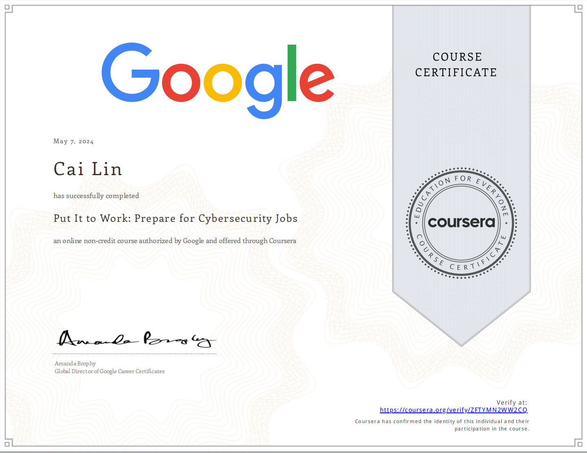

# Put-It-to-Work-Prepare-for-Cybersecurity-Jobs

## Module 1: Protect data and communicate incidents 

## Module 2: Escalate incidents

## Module 3: Communicate effectively to influence stakeholders

## Module 4: Engage with the cybersecurity community 

## Module 5: Find and apply for cybersecurity jobs  

 

# Proof of Completion

